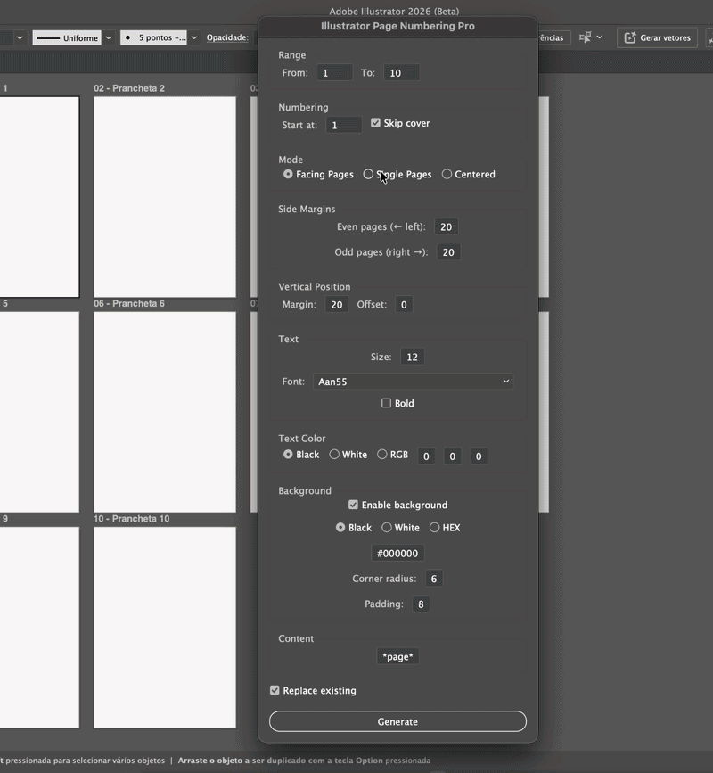

# Illustrator Page Numbering Pro
Advanced page numbering script for Adobe Illustrator.

Add fully customizable page numbers to your artboards with support for facing pages, independent margins, centered layout, and background labels.

---

## ✨ Features

- ✅ Facing pages (odd/even positioning)
- ✅ Single page mode
- ✅ Centered numbering
- ✅ Independent margins for odd and even pages
- ✅ Vertical offset control
- ✅ Custom text (use *page*)
- ✅ Font selection (real Illustrator fonts)
- ✅ Text styling (size, color, bold)
- ✅ Background box with:
  - padding
  - rounded corners
  - color (black, white, HEX)
- ✅ Skip cover option
- ✅ Replace existing numbering

---

## 🖥️ Preview

### Example layout

---

## 📦 Installation

1. Download the `.jsx` file
2. Place it in:
   - **Windows:**  
     `C:\Program Files\Adobe\Adobe Illustrator\Presets\en_US\Scripts`
   - **Mac:**  
     `/Applications/Adobe Illustrator/Presets/en_US/Scripts`
3. Restart Illustrator

---

## ▶️ How to use

1. Open your document
2. Go to:  
   `File > Scripts > Illustrator Page Numbering Pro`
3. Configure your layout
4. Click **Generate**

---

## 🧩 Use cases

- Editorial design
- Magazines
- Catalogs
- Books
- Print-ready layouts
- Multi-artboard projects

---

## ⚙️ Notes

- Works with any number of artboards
- Uses document coordinate system
- Creates a dedicated layer: **Page Numbers**

---

## 🚀 Future improvements

- Presets (magazine, book, catalog)
- Saved configurations
- UI preview inside artboards

---

## 👩‍💻 Author

Developed by opaverick  

---

## 📄 License

Free to use and modify
